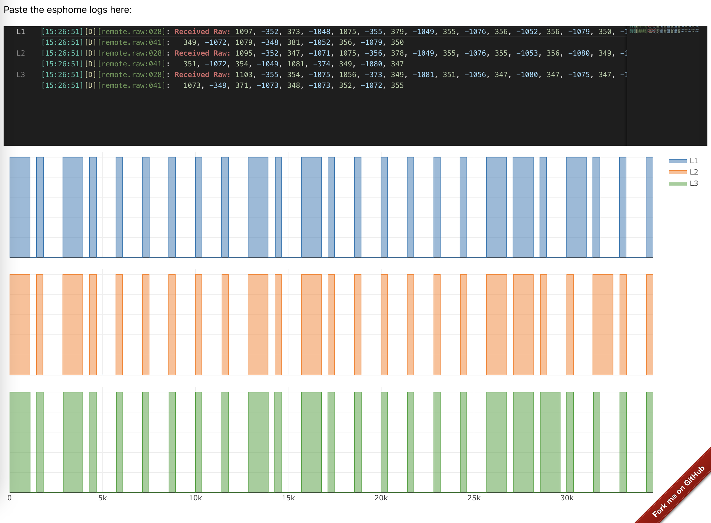

## esphome-remote_receiver-oscilloscope

This is an online tool
# [Click here to use it now](https://dbuezas.github.io/esphome-remote_receiver-oscilloscope)

To use it just configure the `dump: - raw` option in your `remote_receiver`, and paste the logs in the text field. The plot updates automatically

